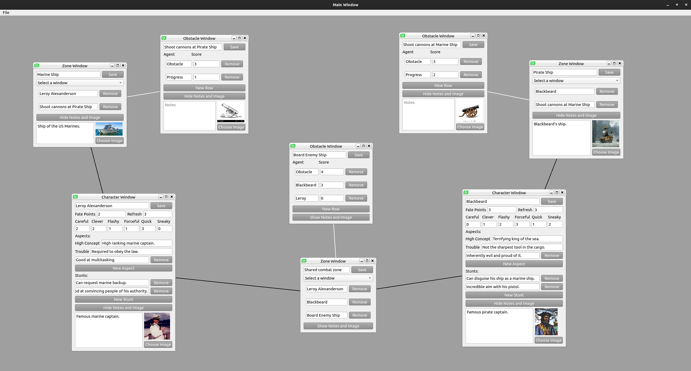

# Fate Accelerated GUI Tool

This is a customizable GUI tool designed for managing various aspects of the Fate Accelerated game. The tool allows you to create, manage, and save different types of windows, including Character, Obstacle, and Zone windows. Each window type has specific fields and functionalities to help you organize your game efficiently.

## Features

- **Character Window**: Manage character details, including aspects, stunts, and approaches.
- **Obstacle Window**: Manage obstacles with agents and scores.
- **Zone Window**: Create zones and associate them with other windows. Zones are linked to their contents.
- **Notes and Images**: Add notes and images to any window.
- **Save and Load**: Save the state of your windows and load them back later.

### Prerequisites

- Python 3.x
- PyQt5